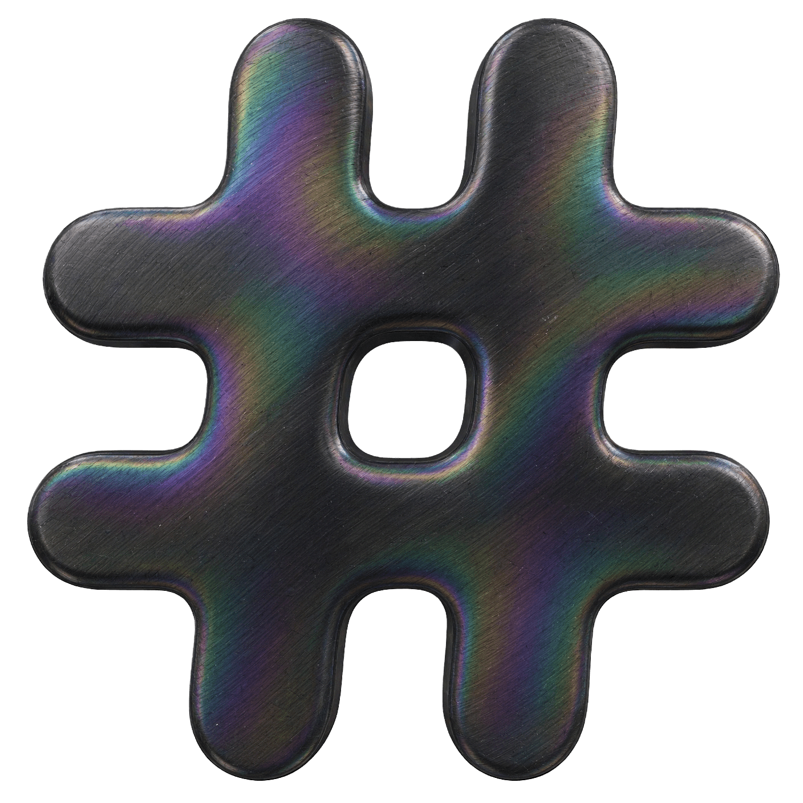

<h1 align="center">
  
  <br />Slick
</h1>
<h3 align="center">The coolest Slack client mod for MacOS, Windows, and Linux</h3>
<div align="center">
  
  
  
</div>

> [!CAUTION]
> This is in early alpha and may not even be allowed by Salesforce. Expect breakage, bugs, and random crashes. The information here may be inaccurate or incomplete, but the code is open source and you can inspect it yourself.


Slick runs Slack's own `app.asar` inside its own Electron (with the handy BYOE acronym, bring your own electron). Slick's code runs before Slack's bundle and patches Slack from the inside, through its module system, React, and Redux, rather than by poking at the page afterwards. Slack's files are never altered, both apps keep updating, and there's no open debug port or resident watcher. This means we are able to patch Slack in a performant and safe way, while still keeping Slack's own updates and security intact.

## Features

- **Kick ass plugins**: Slick has the most plugins of any Slack mod, and you can write your own in JavaScript or TypeScript.
- **Desktop sign in with cookies**: Slick can sign you in to Slack without opening a browser if you provide it your `d` cookie! Great for sandboxed installs.
- **Themes**: pick from a few built-in themes, or write your own CSS with Monaco.
- **Updates**: Slick handles all the updates for itself and Slack automatically, so you don't have to worry about it.
- **Cross-platform**: Slick works on macOS, Windows, and Linux with browsers coming soon.
- **Open source**: Slick is free and open source under the GPLv3 license. You can inspect the code, contribute, or fork it to your heart's content.
- **Fully private**: Slick does not collect any of its own and disables Slack's spyware.

## Compare

| Feature                      | **Slick**                                 | [Taut](https://github.com/jeremy46231/taut) | [Rope](https://github.com/anirudhb/rope) |
| ---------------------------- | ----------------------------------------- | ------------------------------------------- | ---------------------------------------- |
| Actively updated             | **Yes**                                   | **Yes**                                     | No                                       |
| Theme support                | **2 Built in themes + Monaco CSS editor** | CSS editor                                  | No                                       |
| Plugins                      | **36**                                    | 33                                          | 8                                        |
| Desktop sign in with cookies | **Yes**                                   | No                                          | N/A                                      |
| Message Logger               | **Deletions + Edit history**              | Out of scope                                | No                                       |
| Auto updates                 | **Client and Slack update together**      | Slack version is pinned                     | Manual updating required                 |
| Supported platforms          | All desktop platforms                     | **Desktop + Browsers**                      | Browser only                             |
| Privacy                      | **Blocks all telemetry**                  | Replaces Slack's telemetry with its own     | Does not block telemetry                 |
| Code sourcing                | **Bundled in the app**                    | Fetched from a remote server                | **Bundled in the userscript**            |

I encourage you to try other Slack mods, but you will find that Slick is the better choice for most!

## Installation

Slick runs Slack's own code. Install the official Slack app first on macOS, Windows, and x86_64 Linux; on arm64 Linux Slick downloads a pinned copy on first launch. Then:

**macOS** (the [official Slack](https://slack.com/downloads/mac) at `/Applications/Slack.app`, not the App Store version):

```bash
curl -fsSL https://raw.githubusercontent.com/3kh0/slick/main/install.sh | bash
```

Got Slack running somewhere else? Add `-s -- --slack-app "/path/to/Slack.app"` after `bash`. You can also grab the `.dmg` or `.zip` from the [releases page](https://github.com/3kh0/slick/releases/latest): `mac-arm64` for Apple Silicon, `mac-x64` for Intel.

**Windows** (the standalone and Microsoft Store versions of Slack both work), in PowerShell:

```powershell
irm "https://raw.githubusercontent.com/3kh0/slick/main/install.ps1" | iex
```

Slick is built for x64. ARM PCs run x64 Slack through emulation, so it works there, just a little slower.

**Linux** (x86_64 or arm64): grab the AppImage, `.deb` or `.rpm` from the [releases page](https://github.com/3kh0/slick/releases/latest), run `nix run github:3kh0/slick`, install the Flatpak, or use the installer below. Whatever floats your penguin loving boat.

```bash
curl -fsSL https://raw.githubusercontent.com/3kh0/slick/main/install-linux.sh | bash
```

On arm64, the AppImage downloads a pinned Slack Linux bundle on first launch, then loads arm64 native addons. This approach is based on [Taut](https://github.com/jeremy46231/taut) (MIT); see [its license notice](./packaging/linux/TAUT-LICENSE.txt). Nix and AUR remain x64-only: arm64 needs separate Slack resources, native addons and platform-specific packaging/pins for each. The arm64 Flatpak downloads the pinned Slack bundle on first launch; the x64 Flatpak still requires installed Slack.

The Flatpak uses a signed Slick repo, so it can update normally via `flatpak update`:

```bash
flatpak install --user https://3kh0.github.io/slick/dev.slick.Slick.flatpakref
```

Launch with `flatpak run dev.slick.Slick` if your desktop menu has not refreshed for some reason. If the browser sign in points elsewhere, run `xdg-mime default dev.slick.Slick.desktop x-scheme-handler/slack` so it takes the slack handler.

To remove the Flatpak, run `flatpak uninstall --user dev.slick.Slick` (use `--system` instead if installed system-wide)

### Uninstalling

- **Windows:** `& ([scriptblock]::Create((irm https://raw.githubusercontent.com/3kh0/slick/main/install.ps1))) -Uninstall`
- **Linux:** `curl -fsSL https://raw.githubusercontent.com/3kh0/slick/main/install-linux.sh | bash -s -- --uninstall`
- **macOS:** Drag the Slick app to the Trash or run `./scripts/uninstall.sh` from a clone.

On Windows and Linux your sign-in and settings are kept unless you add `-Purge` / `--purge`. To hand `slack://` links back to the official app without uninstalling, pass `-RestoreHandler` / `--restore-handler` to the installer.

### Build from source

Clone the repo and run `./install.sh` (macOS), `./install-linux.sh` (Linux) or `powershell -ExecutionPolicy Bypass -File install.ps1` (Windows). They build Slick from your checkout instead of downloading a release. Plugins live in `src/plugins/<Name>/`, one folder each.

### Browser extensions (experimental)

Slick runs in the Slack web client through Manifest V3 extensions for Firefox and Chromium browsers, including Helium. Both builds share the same 35 bundled plugins, themes, custom CSS, imported theme JSON and recovery controls. Snappy includes animation, selector, resize and composer spellcheck controls; its GPU and crash reporter controls remain desktop-only. HaikuWarning checks messages offline using its bundled Orpheus dictionary. AccountSwitcher uses a separate extension account manager to save and restore browser sessions. ShutUpSlackbot marks Slackbot slash-command registration notices as read and suppresses their web notifications and sounds while the Slack client is open. BetterGifs and QuietSpotify remain excluded. Plugins start disabled and can be enabled individually using the Slick toolbar button or Slack preferences.

For Firefox, download `slick-firefox-*.xpi` from the [latest release](https://github.com/3kh0/slick/releases/latest). For Helium/Chromium, build locally, open `chrome://extensions`, enable **Developer mode**, choose **Load unpacked**, and select `dist/extension/chromium`:

```bash
npm install
npm run extension:build
```

The build also produces `dist/extension/slick-chromium.zip` for Chrome Web Store submission. The extension is not yet listed in the store. **Bypass Slick** reloads the current Slack tab without Slick; **Safe mode** disables plugins. Slack's Content Security Policy stays enabled. All executable extension code, fonts and images are packaged locally; certain opt-in plugins fetch data from external services.

Run the local Helium MVP checks with `npm run extension:smoke:chromium`. Run `npm run extension:dev:helium -- --slack-url https://hackclub.slack.com` for a visible, disposable profile and live Slack startup checks after signing in. The harness also creates a 1280×800 settings screenshot and 440×280 promotional image in `dist/extension/store`. It checks early injection, CSP, the settings/CSS bridge, IndexedDB, options, request blocking, worker restart, bypass and safe mode. It reports live plugin startup separately from fixture checks. Use `--connect-profile /path/to/disposable/profile --extension-id <id>` to reuse a signed-in test session. Pass `--browser /path/to/chromium` to test another Chromium binary. Disposable profiles left open for preview should be removed after closing the browser; the script prints their path.

### Extension work plan and Chrome Web Store submission

1. **Shared MVP:** keep one plugin allowlist and page bundle; use Firefox event pages and a Chromium service worker, with browser-specific manifests and toolbar icons. Preserve settings, CSS and plugin storage across suspension.
2. **Local validation:** run extension tests, TypeScript, lint, `npm run extension:validate`, Firefox manifest validation and real Helium checks. Verify all 34 plugins start in authenticated Hack Club Slack; separately exercise individual plugin interactions before broader release.
3. **Packaging:** build reproducible Firefox XPI and Chromium ZIP artifacts in CI and attach both to releases. Bundle executable code locally and limit page access to `app.slack.com`.
4. **Store submission:** publish the extension privacy policy below at a public URL, register the developer account, upload the ZIP, supply screenshots/store artwork, complete permission and data-use disclosures, provide reviewers Slack test access/instructions, then submit for review. Store approval is separate from a working MV3 package.

Suggested store name: **Slick for Slack**. Single purpose: customize the Slack web client with opt-in plugins, themes and custom CSS. Suggested description: “Customize Slack with bundled plugins, themes and custom CSS. Enable plugins individually, import theme JSON, and recover using bypass or safe mode. Works with Slack in your browser; no desktop Slack installation required. Unofficial, open-source software, unaffiliated with Slack or Salesforce.”

| Permission                | Reason                                                                                                                      |
| ------------------------- | --------------------------------------------------------------------------------------------------------------------------- |
| `storage`                 | Save settings, CSS, plugin preferences and session recovery exemptions locally. Plugin logs and picked files use IndexedDB. |
| `scripting`               | Run packaged recovery and account handoff functions in Slack tabs.                                                          |
| `declarativeNetRequest`   | Block telemetry and gated embeds for Slack-initiated requests.                                                              |
| `https://app.slack.com/*` | Run the packaged Slack client scripts and recovery controls.                                                                |

AccountSwitcher additionally requests optional `cookies` (save/restore Slack session cookies), `browsingData` (clear stale Slack client data during a switch) and `https://*.slack.com/*` (access Slack session cookies and verify sessions with workspace `auth.test`). These are requested from its account manager rather than at installation.

The privacy form must describe locally handled website content, personal communications, identifying information and authentication information when the corresponding plugins are enabled. Do not claim that no user data is handled just because storage is local. External JSON rule sets are data, not downloaded executable code. See the official [MV3 policies](https://developer.chrome.com/docs/webstore/program-policies/mv3-requirements), [user-data requirements](https://developer.chrome.com/docs/webstore/program-policies/user-data-faq) and [store image requirements](https://developer.chrome.com/docs/webstore/images).

AccountSwitcher requires a user click in its extension account manager to save or switch a session. Grant its optional Slack session permissions there, choose the current Slack tab and save it (an optional name helps distinguish accounts). **Save and sign in to another account** preserves the current account, then starts a fresh web sign-in. Return to the manager after sign-in and save the new account. Selecting an account from Slack’s profile menu opens this manager; it never switches cookies directly from the page. Switching affects normal Slack tabs throughout the browser profile and clears unsent drafts and cached Slack data. Interrupted changes have an encrypted recovery record; use **Recover interrupted switch** if the manager reports one.

### Browser extension privacy policy

Slick uses data only to provide the plugins, themes and settings you choose. Slick does not run an analytics service, sell data, use data for advertising, or send Slack messages to the Slick developers. Its use of user data follows the Chrome Web Store User Data Policy, including the Limited Use requirements.

The extension reads the Slack client to customize its interface. Depending on enabled plugins, it processes messages, profile information, user/channel identifiers and activity. MessageLogger keeps bounded local message deletion/edit history; LastSeen keeps local activity records. Settings, CSS, imported themes and plugin records stay in the browser profile. CustomFonts and CustomSounds store files you select locally. Disabling a plugin stops its activity but does not automatically erase its saved data. Plugin controls can clear history where provided; uninstalling the extension removes its extension storage. Plugin logs and ordinary preferences are not encrypted by Slick; access depends on your browser and operating system protections. AccountSwitcher stores session cookies and workspace tokens in a separate extension-private IndexedDB vault encrypted with AES-GCM and a non-extractable key. The key stays in the same browser profile; this is not password or operating-system keychain protection. Credentials are not synced, exported or exposed to the Slack-page bridge.

AccountSwitcher requests optional `cookies`, `browsingData` and `https://*.slack.com/*` access only when you enable session access in its account manager. It verifies sessions with Slack’s `auth.test` endpoint and never sends credentials to Slick servers. A switch pauses normal Slack tabs, replaces the profile’s Slack session cookies and clears cached client data, including unsent drafts. Saved accounts can be removed in the manager; disabling the plugin does not delete them. Private windows and Firefox containers are not switched.

Optional external services: ClearURLs downloads JSON tracking-parameter rules from `raw.githubusercontent.com`; HCA Status sends Slack user IDs to `auth.hackclub.com` and reads verification/age-category results; Private Channel Mapper sends channel IDs or exact channel names to `flaron.halceon.dev` when its external-lookup settings are enabled. These services receive ordinary request metadata such as your IP address and follow their own privacy practices. These lookups use HTTPS. Slack continues to handle your normal Slack traffic under its own policies. CSS you enter can also request resources you reference in it.

For privacy questions, use the project's [support/issues page](https://github.com/3kh0/slick/issues); do not include private Slack messages, credentials or local browser-profile data in public reports.

## Updates

Slick updates itself every few hours, and checks every download against its GitHub build attestation before installing it. To check by hand, use **Slick > Check for Updates…**. On macOS and standalone Windows it also keeps Slack itself up to date. On Linux arm64, Slick pins the downloaded Slack bundle to its release and downloads a new pin when Slick updates. The Microsoft Store, the deb and rpm packages, Flatpak and Nix update through their own package managers instead. Running through the installer again will also get you the latest version if it somehow breaks.

## Themes

Import a `.json` theme from **Slick Preferences → Appearance → Import theme JSON** (or Appearance in the Firefox toolbar popup). Imported themes are saved, selected immediately, and can be picked again from the theme list or removed with **Remove imported theme**. Match Slack’s native Light or Dark mode to the theme.

The `themes/` folder in the source repository contains built-in themes bundled at build time. Adding files there won't load them into an installed app; use the import button instead. Theme JSON uses this format:

```jsonc
{
  "name": "Super cool epic theme",
  "palette": { "highlight1": { "100": "139,92,246" } }, // --dt_color-plt-<ramp>-<shade>, raw "r,g,b"
  "sidebar": { "nav-bg": "#1A1525" }, // --p-team_sidebar__<key>
  "vars": { "--any-css-var": "value" }, // overrides
  "css": "selector { prop: val !important; }", // raw css (string or array)
}
```

Some people like how Slack looks by default, but you can pick one from the Slick tab in Preferences. `themes/amoled.json` (true black) and `themes/catppuccin-mocha.json` ([Catppuccin](https://catppuccin.com) Mocha) are working examples.

Prefer to write your own CSS instead? Open the CSS editor in Slick Preferences (or the Custom CSS field in Firefox). It accepts raw CSS, which applies on top of your selected theme. JSON theme files belong in **Import theme JSON**, not the CSS editor. Choose **Custom CSS only** to use your CSS without a theme.

## Credits

- [Slack](https://slack.com/) for the original app and its delightful internals.
- [Electron](https://www.electronjs.org/) for the runtime and APIs.
- [@ImShyMike](https://github.com/ImShyMike) for advice on breaking into Slack.
- [Vencord](https://github.com/vencord) for plugin inspiration.
- [Taut](https://github.com/jeremy46231/taut) (MIT) by [@jeremy46231](https://github.com/jeremy46231), which has a lovely injection and patching model Slick is built on.
- Claude for cleaning up the code and generally being a good assistant.

## Legal

This is under the GNU General Public License v3.0. See the [LICENSE](LICENSE) file for the legal mumbo jumbo. In short: just don't be a dick. If you're not sure what that means, see [choosealicense.com/licenses/gpl-3.0](https://choosealicense.com/licenses/gpl-3.0/). This code is provided to you for free, use at your own risk. I am not responsible for any harms due to the code here. Don't sue me.
